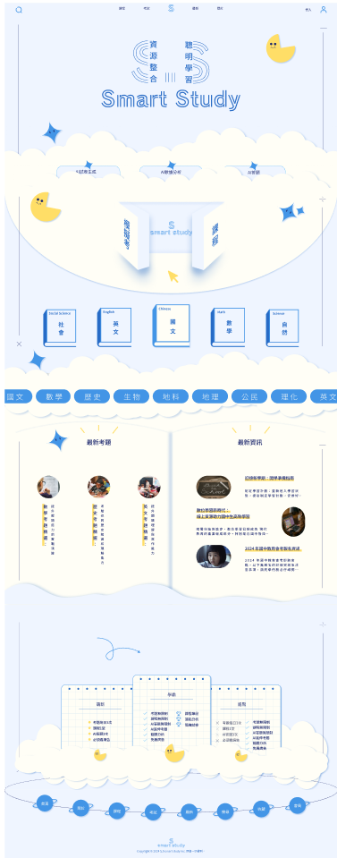
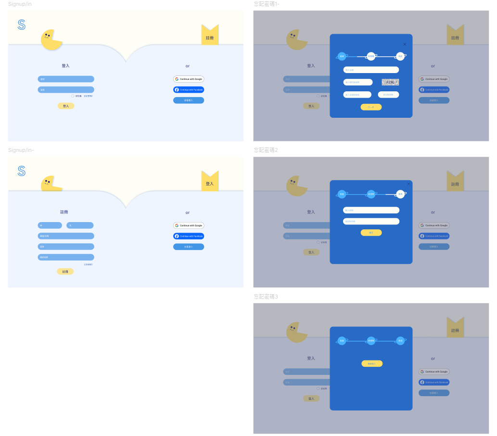
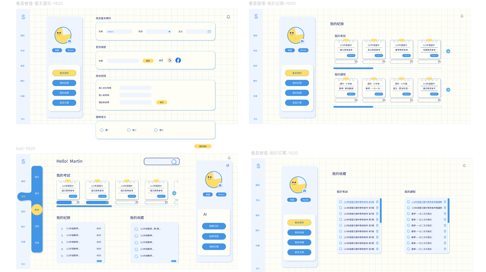
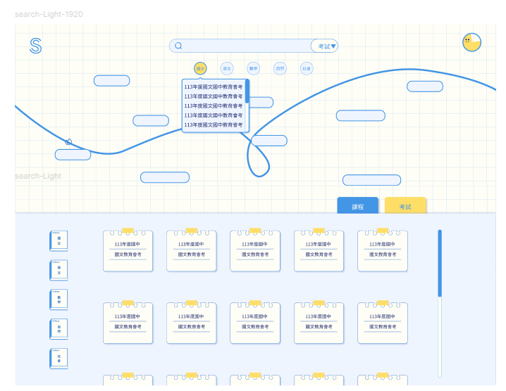
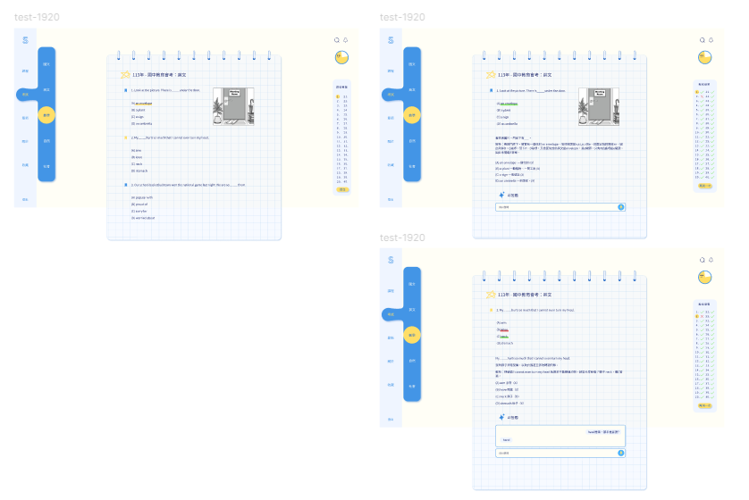

# Smart Study教學平台

## 基本說明
專題由**郭懿嫻**、**侯譯筑**、**連韋傑**共同製作
### 動機與目的
現有教育資源分散、缺乏有效整合與評價機制，想提供一個能夠即時反饋和評估學習進度的平台，以提高教學效果和學習成效。
我們想要打造一個多元且無邊界的學習環境，網頁整合了人工智慧和互動式人工智慧，使用者可以省去查找資料的時間，並且補充學校沒有的資源，進而提升學業成績。
### 網頁分工
郭懿嫻:UI、UX設計、主要視覺設計

侯譯筑:網站程式撰寫

連韋傑:網站程式撰寫

	
	
### 使用平台
	* Windows: Visual Studio Code
## 使用技術
### 網頁切版 :
	html, css, javascript
### 第三方套件運用 :
	jQuery Smoove、Google登入API、fb登入API
## 前台導覽

### 首頁 : 
由譯筑負責製作

### 會員註冊 : 
由譯筑負責、懿嫻共同製作

### 會員內頁 : 
由譯筑負責、韋傑共同製作

### 題目搜尋 : 
由譯筑負責製作

### 題目測驗 : 
由韋傑負責製作

## 作品聲明

* 使用圖片資源 : google
*  **此專案是產業新尖兵計畫-互動式前端網頁設計與開發實務班(第6梯次)的期末專題，無實際商業行為**